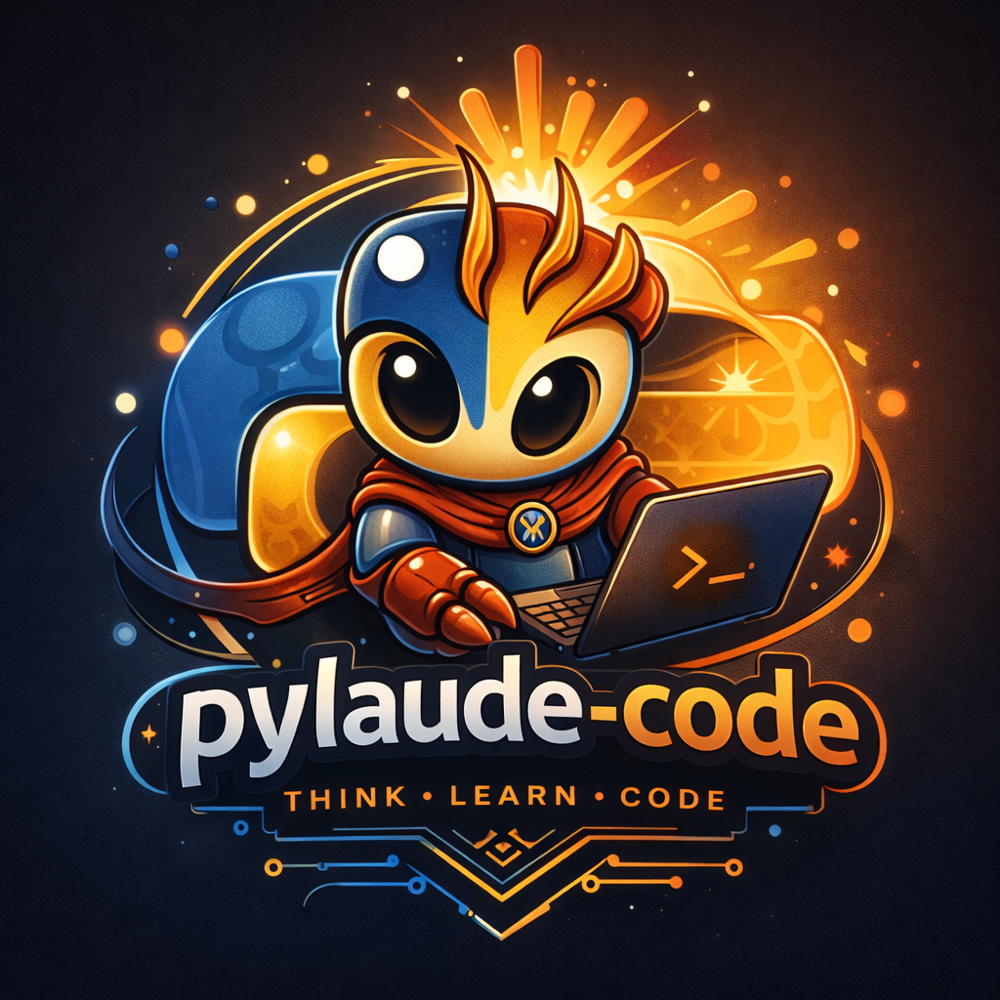

# pylaude-code

<p align="center">
  
</p>

<p align="center">
  <strong>A Python-native coding agent runtime aiming to rebuild the depth, seriousness, and terminal power of a world-class code CLI.</strong>
</p>

<p align="center">
  <strong>Think. Learn. Code.</strong>
</p>

<p align="center">
  <a href="#what-is-pylaude-code">What is pylaude-code?</a> |
  <a href="#why-this-project-exists">Why this project exists</a> |
  <a href="#highlights">Highlights</a> |
  <a href="#current-status">Current status</a> |
  <a href="#installation">Installation</a> |
  <a href="#quick-start">Quick start</a> |
  <a href="#repository-layout">Repository layout</a> |
  <a href="#security-and-legal-position">Security and legal position</a> |
  <a href="#roadmap">Roadmap</a> |
  <a href="#license">License</a>
</p>

---

## What is pylaude-code?

`pylaude-code` is a Python-first coding agent runtime being built to deliver a serious terminal experience for software engineering work.

The goal is not to produce a thin wrapper around prompts.

The goal is to build a real runtime for:

- codebase exploration
- architectural reasoning
- tool orchestration
- controlled file and shell operations
- session continuity
- extensible integrations
- terminal-native developer workflows

At its full maturity, `pylaude-code` is intended to feel like a powerful coding CLI with a deeper internal structure: more inspectable, more auditable, more extensible, and more comfortable to evolve in Python.

---

## Why this project exists

There is a clear gap between:

- AI coding tools that look impressive in demos
- and AI coding runtimes that can actually be trusted, extended, and maintained over time

`pylaude-code` exists to close that gap.

This repository is being shaped around a strong idea:

> the best coding agent is not only powerful in use, but understandable in structure.

That means the project is designed to care about:

- explicit runtime behavior
- predictable tool execution
- clear system boundaries
- durable session semantics
- auditable permission models
- high-quality terminal UX

This is the kind of project for people who want a coding agent with real engineering discipline behind it.

---

## Highlights

- **Python-native runtime**
  - built around Python `3.12` with a modern toolchain
- **Terminal-first product direction**
  - not a browser-first assistant awkwardly mirrored into a shell
- **Structured runtime foundation**
  - bootstrap, runtime, permissions, sessions, MCP, plugins, and UI are being separated into explicit subsystems
- **Extensibility as a first-class concern**
  - the architecture is being prepared for tools, integrations, and plugin-style growth
- **Auditability over magic**
  - the codebase aims to stay readable enough for advanced contributors to reason about it
- **Behavioral seriousness**
  - the product direction favors deterministic control, explicit trust boundaries, and operational clarity

---

## Product direction

The intended core stack is:

- Python `3.12`
- `uv`
- `prompt_toolkit`
- `rich`
- `anyio`
- `pydantic`
- `pytest`

This combination is meant to support a runtime that is:

- interactive
- concurrent
- type-aware
- testable
- and comfortable to operate from a real terminal workflow

---

## Current status

Current status: **pre-alpha**.

This repository already contains the early Python runtime foundation, but it is not yet a finished end-user product.

### What is already in the repo

- a Python package root in [`pylaude/`](./pylaude)
- a CLI entrypoint and bootstrap pipeline scaffold
- runtime authority mapping and parity manifest scaffolding
- early settings and permissions models
- replay, parity, and unit test scaffolding in [`tests/`](./tests)
- project documentation under [`docs/porting/`](./docs/porting)
- branding asset: [`pylaude_logo.png`](./pylaude_logo.png)

### What is not finished yet

- the full coding loop
- the complete interactive terminal UI
- the full tool execution runtime
- complete session persistence compatibility
- full MCP/plugin lifecycle behavior
- production-grade parity verification

That is expected at this stage.

This repository should currently be read as an ambitious, actively forming product codebase rather than a completed release.

---

## Installation

### Requirements

- Python `3.12` or newer
- `uv` recommended

### Recommended install

```bash
uv sync
```

### Alternative install with pip

```bash
python -m venv .venv

# Linux / macOS
source .venv/bin/activate

# Windows PowerShell
.venv\Scripts\Activate.ps1

pip install -e .[dev]
```

If you are setting this up on Windows, PowerShell is fine. If your local Python installation is not already on `PATH`, install Python first and then rerun the commands above.

---

## Quick start

After installation, you can inspect the current Python runtime scaffold:

```bash
pylaude --print-bootstrap
pylaude --print-authorities
pylaude --print-trace-manifest
```

These commands expose the early runtime foundation:

- bootstrap order
- tracked system authorities
- planned parity scenarios

They are useful today for understanding the shape of the project even before the full interactive runtime is complete.

---

## Development

### Run tests

With `uv`:

```bash
uv run pytest
```

With a local virtualenv:

```bash
pytest
```

### Development goals

The repository is being developed around a few non-negotiable qualities:

- clear subsystem ownership
- explicit runtime state
- controlled side effects
- terminal-native UX
- maintainable Python architecture

This is not intended to become a sprawling pile of scripts.

It is intended to become a coherent coding runtime.

---

## Repository layout

```text
.
├── docs/
│   └── porting/      Architecture, invariants, and parity planning
├── pylaude/          Python runtime under construction
│   ├── bootstrap/    Startup pipeline and shared context
│   ├── cli/          CLI entrypoint
│   ├── runtime/      Authorities, parity manifest, comparison helpers
│   ├── settings/     Settings precedence logic
│   ├── permissions/  Permission policy foundation
│   ├── sessions/     Session and transcript models
│   ├── mcp/          MCP boundary models
│   ├── plugins/      Plugin boundary models
│   ├── ui/           Terminal UI ownership boundary
│   ├── tools/        Tool registry ownership boundary
│   ├── models/       Shared message and schema models
│   └── telemetry/    Telemetry primitives
├── src/              Original TypeScript implementation being studied and re-created
├── tests/            Unit, parity, and replay test scaffolding
├── pyproject.toml    Python package and tool configuration
├── LICENSE           MIT license
└── README.md         Project overview
```

---

## Architecture principles

`pylaude-code` is being built around explicit engineering boundaries.

The runtime is expected to keep strong separation between:

- bootstrap and startup sequencing
- interactive CLI/TUI control flow
- model interaction
- tool execution
- permission enforcement
- persistence and session recovery
- external integrations

The product should feel seamless to use, but the internals should remain inspectable.

That is a deliberate design choice.

---

## Security and legal position

`pylaude-code` is being built with respect for legal boundaries and product identity.

This project is intended to be:

- independent
- original in implementation
- careful about branding and representation
- respectful of intellectual property and applicable terms

It aims to build a powerful Python coding runtime inspired by a high standard of product quality, while remaining its own project with its own code, architecture, and direction.

On the technical side, the project direction also places strong emphasis on:

- explicit permission models
- bounded tool execution
- clear trust surfaces
- durable and auditable runtime behavior

---

## Who this is for

`pylaude-code` is aimed at:

- developers who spend serious time in the terminal
- Python engineers who want a high-quality coding assistant runtime
- contributors who care about architecture, not just features
- advanced users who want visibility into how their tooling behaves

If you want a black-box tool with minimal internal structure, this is probably not the project you are looking for.

If you want power with clarity, it may be.

---

## Roadmap

### Near term

- deepen the Python runtime foundation
- harden settings, permissions, and session semantics
- build real parity and replay workflows
- shape the first serious terminal interaction loop

### Mid term

- implement the core coding cycle
- mature tool execution and control flows
- strengthen session continuity
- expand MCP and plugin support

### Long term

- deliver a polished Python-native coding CLI
- support advanced engineering workflows in the terminal
- keep the codebase extensible and readable as capability grows

---

## Contributing

Contributions are welcome, but quality matters more than churn.

Good contributions should improve one or more of these:

- capability
- clarity
- safety
- architecture
- developer experience

The standard is not just "works on my machine."

The standard is whether the repository becomes stronger, cleaner, and more credible as a serious coding runtime.

---

## License

This project is licensed under the MIT License.

See [`LICENSE`](./LICENSE) for the full text.
